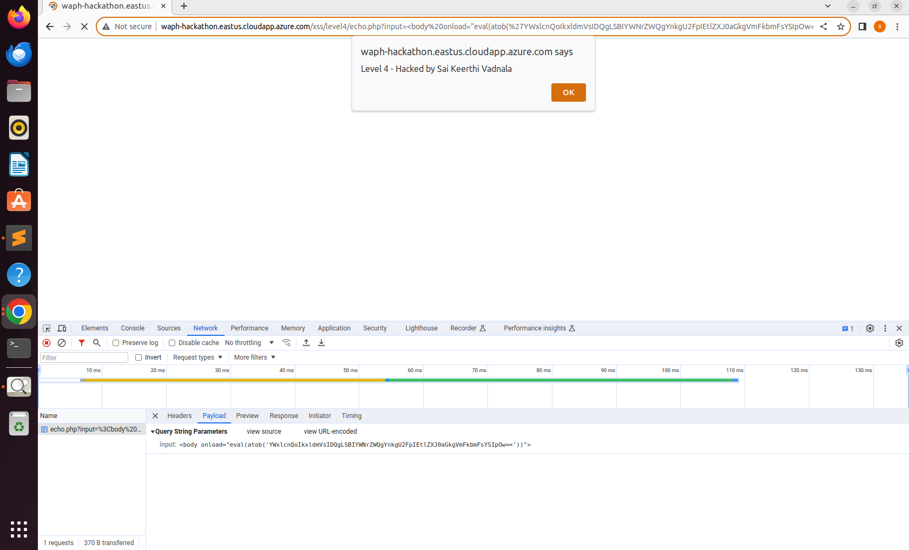

# WAPH-Web Application Programming and Hacking

## Instructor: Dr. Phu Phung

## Student

**Name**: Sai Keerthi Vadnala

**Email**: vadnalsi@ucmail.uc.edu

**Short-bio**: Sai Keerthi Vadnala has great interest in learning web development and wants to explore more about it by doing handson projects.

 

## Hackathon 1 Overview
- Hackathon 1 focuses on Cross-site Scripting Attacks and Defenses.
- Task 1 involves exploring attacks executed through various methods.
- I comprehended the process of cross-site scripting attacks occurring on websites.
- Task 2 is about input validations and encoding techniques.
- I understood the concept of data validation before and after the response.

## Repository Information

Respository's URL: [https://github.com/Saikeerthi72/waph-vadnalsi.git](https://github.com/Saikeerthi72/waph-vadnalsi.git)

This is a private repository for Sai Keerthi Vadnala to store all code from the course. The organization of this repository is as follows.

### Hackathon

  - [Hackathon 1](https://github.com/Saikeerthi72/waph-vadnalsi/tree/main/Hackathon): Cross-site Scripting Attacks and Defenses

## Task 1 - Attacks

- Task 1 dealt with various attack techniques.
- I comprehended how cross-scripting attacks occur on websites.
- Task 2 covered input validations and encoding techniques.
- I comprehended how the data is validated both before and after the response.

There are total seven levels of cross-site scripting attacks
[http://waph-hackathon.eastus.cloudapp.azure.com/xss/](http://waph-hackathon.eastus.cloudapp.azure.com/xss/)

- **Level-0**

- In this level, we must enter an alert message in the input field. 
- After submitting, the following alert message is popped, below is the screenshot for Level 0 (Fig 2) 

 

 

**Level-1**

- For level 1, I included a script tag with an alert message in the URL
- After executing the URL, the alert message is displayed
- Output of level 1 (Fig 3).

 

 

**Level-2** 

- For level 2, we must provide input from an HTTP post request. 
- To do this, I used the lab2 html file. Next, I edited the Post request form, changing the action attribute from echo.php to the given url.  
- Next, I changed the value from data to input. Later, I entered the input into the Html Post request's input field. 
- Level 2 code (fig 4): 

 

 

**Level-3** 

- I have edited the script tag at Level 3. 
- To do this, I included a script tag inside another script tag. The output of the first script tag is filtered out, revealing the second script tag. 
- The code and output are shown in (fig 5) 

 

 

**Level-4**

- Level 4 code doesnt allow server side code in input fields. 
- To get this, I have encoded the characters in base64 format. 
- Output is shown below (fig 6)

 

 

**Level-5**

- I have provided the img tag without source with onerror method.
- When the error is executed, the charcode, which is in ascii value, it is converted to a string
- An alert message prints the screenshot is shown in (fig 7). 

 

 

**Level-6**

- Server side data is encoded
- I updated the form action in the element section by inserting img src before the input
- The alert script is executed and dislayed when I hover over the image. (fig 8)

 

 

## Task 2 - Defenses

- **echo.php**

- I implemented input validation for the echo.php file located in lab 1.
- Clicking submit without entering any input triggers the validation message "Please enter data field".
- The validation result is displayed in (Fig 9).

 

 

-Commit message of Github (Fig 10).

 

 

- **Current front end prototype**

- I have performed input validations for user inputs in the front end webpage and screenshots are attached below.
- The getEcho code commit with input validation is shown (fig 11).

 

 

- The JqueryAjax code commit with input validation is shown (fig 12).

 

 

- The JqueryAjax Post code commit with input validation is shown (fig 13).

 

 

- The HTTP Post code for user input validation method is shown (fig 14)

 

- From HTTP POST user input validation method commit is provided below (fig 15)

 

- I have applied an encoding method before sending the output to the server in the echo.php file.
- Firstly, the response undergoes encoding using encodeURIComponent before displaying the encoded message.
- Then the decoded message can be printed.
- Console messages are provided for validation purposes to ensure the correct response.
- Output is shown (fig 16,17).

 
 
 
 

 
 
 
 
