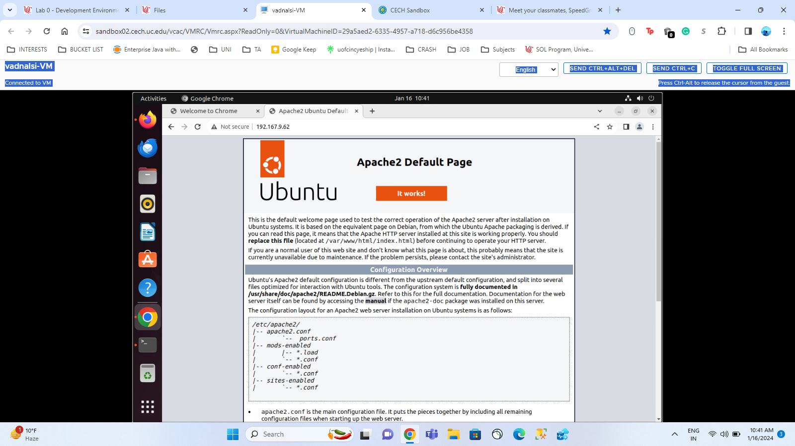
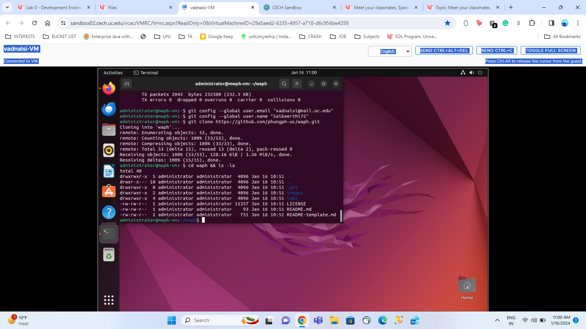
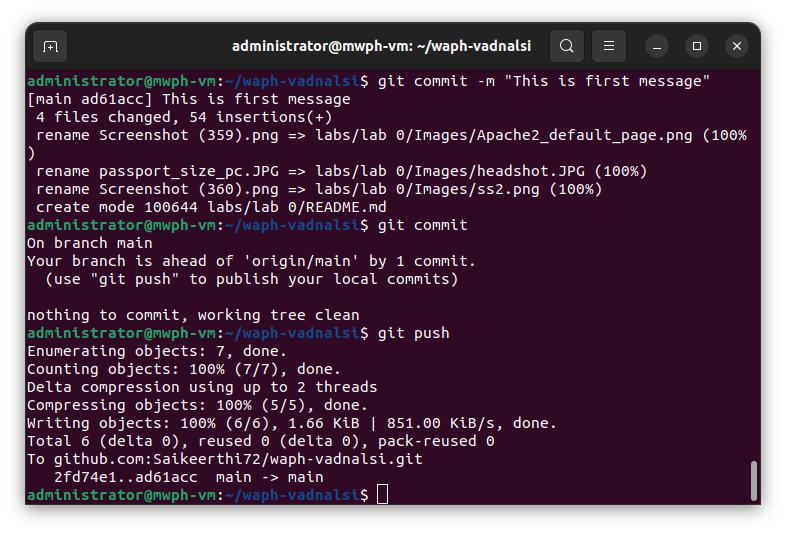

# WAPH-Web Application Programming and Hacking

## Instructor: Dr. Phu Phung

## Student

**Name**: Sai Keerthi Vadnala

**Email**: vadnalsi@ucmail.uc.edu

**Short-bio**: Sai Keerthi has great interest in learning web development and wants to explore more about it by doing handson projects.

 

## Repository Information

Respository's URL: [https://github.com/Saikeerthi72/waph-vadnalsi.git](https://github.com/Saikeerthi72/waph-vadnalsi.git)

This is a private repository for Sai Keerthi Vadnala to store all code from the course. The organization of this repository is as follows.

### Labs 

[Hands-on exercises in lectures](labs) 

  - [Lab 0](labs/lab0): Development Environment Setup 
## Part I - Ubuntu Virtual machine & Software Installation
- Firstly I have used "sudo apt net-tools" command. This command helps in administering and troubleshooting network issues. 
- Next I have installed apache web server, git, and sublime text using following commands respectively, "sudo apt install apache2", "sudo apt install git", "sudo snap install sublime-text --classic".
- I have installed pandoc to convert markdown files to pdf reports using the following command "sudo apt install pandoc". Also installed **pdflatex** and its fonts which are used in rendering pdf files.

## Apache Web Server Testing
 

## Part II - git Repositories and Exercises

## The Course repository
 

## Private repository
- I have logged into my Github account, and clicked on "New" to create a new repository
- I have named the repository as **waph-vadnalsi**, selected it as Private, and created the repository.
- URL of the repo: [https://github.com/Saikeerthi72/waph-vadnalsi.git](https://github.com/Saikeerthi72/waph-vadnalsi.git)
- In the handson exercises, I have generated and setted SSH Keys using commands: ssh-keygen, ls ~/.ssh, ls ~/.ssh/id_rsa.pub from the terminal and copied the key.
- And I have added the key to my github account: Click on settings > SSH and GPG Keys > New SSH Key.
- I have named the Key as *UbuntuVM* and pasted the copied key here.
- I have cloned the remote repository into my VM using command: git clone git@github.com:Saikeerthi72/waph-vadnalsi.git
- I have created a labs folder inside the waph-vadnalsi (local repository) and has copied the contents of README-template.MD from waph folder to README.MD file of waph-vadnalsi

 

