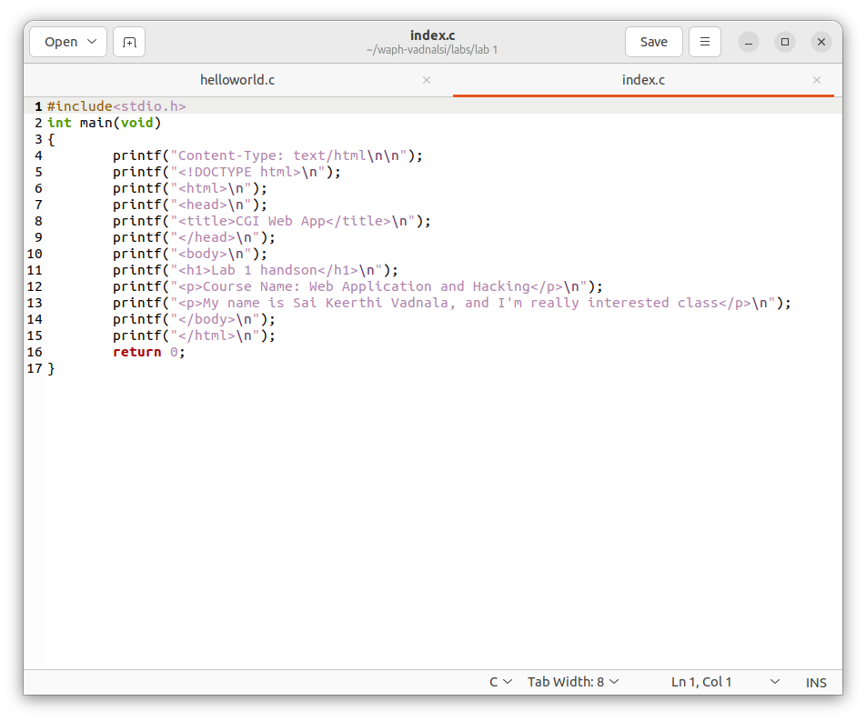
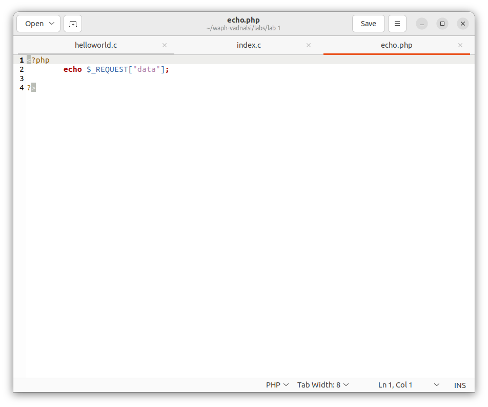

# WAPH-Web Application Programming and Hacking

## Instructor: Dr. Phu Phung

## Student

**Name**: Sai Keerthi Vadnala

**Email**: vadnalsi@ucmail.uc.edu

**Short-bio**: Sai Keerthi Vadnala has great interest in learning web development and wants to explore more about it by doing handson projects.

 

## Lab Overview

- Lab 1 describes about the foundations of web.
- This lab contains 2 parts: The Web and Http protocol, Basic web application programming. 
- Part 1 focuses on the web and http protocol, working with Wireshark for network packet analysis and gaining understanding of Telnet and wireshark.
- Part 2 focuses on working with CGI web applications in C, developing a simple PHP web application with user input, and understanding of HTTP GET and POST requests.

## Repository Information

Respository's URL: [https://github.com/Saikeerthi72/waph-vadnalsi.git](https://github.com/Saikeerthi72/waph-vadnalsi.git)

This is a private repository for Sai Keerthi Vadnala to store all code from the course. The organization of this repository is as follows.

### Labs 

[Hands-on exercises in lectures](labs) 

  - [Lab 1](https://github.com/Saikeerthi72/waph-vadnalsi/tree/main/labs/lab%201): Foundations of the Web

## Part I - The Web and HTTP Protocol
## Task 1. Familiar with the Wireshark tool and HTTP Protocol

- Wireshark is a network protocol analyzer that enables analysis of network traffic.
- Firstly, to install the tool use 'sudo apt install wireshark -qt'.
- To verify the version use 'wireshark --version' and to run the application use 'sudo wireshark &'.
- Open the wireshark, click on the 4th icon to setup, select 'any' in the next step and 'start' button to start capturing.
- Now open the browser and browse 'example.com' link.
- Open the wireshark tool and click on stop capturing and filter by 'http' to see the http request and response messages.
- Click on http request GET/index.html and analyze the http request message.
- Similarly, click on the http response message and analyze it.
- Next, right click on the http request, click on follow, select HTTP stream.
- Below are the screenshots for Task 1 (Fig. 2,3,4).
 

 

 

## Task 2. Understanding HTTP using telnet and Wireshark

- Telnet is a network protocol used to make a TCP connection to the server to send and receive data to/from the server.
- In this task, we will use a telnet program to send a minimal HTTP request and wireshark tool to examine the HTTP messages
- Open wireshark and start capturing the packets
- Revert to the terminal and enter 'telnet example.com 80'
- If it establishes connection it would prompt to enter: 
GET ./Index.html HTTP/1.0
Host: example.com
- Click twice on enter, open wireshark and stop capturing packets
- Now open the server you could see the http request and responses
- Below are the screenshots for Task 2 (Fig. 5,6,7).

 

- While using telnet, it prompted to enter GET http request and host name, where when used through web the request was read automatically
- The difference between http request message and the one on the browser sent can be seen in the fields like: cache-control, content-type, connection,accept-encoding, accept-language, accept-encoding.

 

- There are not many differences between Http response in telnet and web 

 

## Part II - Basic WEB Application programming

## Task 1. CGI Web Applications in C
# a. Develop a Hello World CGI program in C - compile and deploy it on web server

- Inorder to start the task, install gcc compiler by using command 'sudo apt install gcc'.
- Enable CGI daemon is not enabled in Apache2 use command 'sudo a2enmod cgid' and restart the server using command 'sudo systemctl restart apache2'.
- Create a helloworld.c file and write the code
- Compile the code using 'gcc helloworld.c -o helloworld.cgi' and execute the file by ./helloworld.cgi 
- Copy the file to /usr/lib/cgi-bin as cgi programs stored in this will be invoked by the apache server
- To deploy use 'sudo cp helloworld.c /usr/lib/cgi-bin'
- Below is the screenshot for this Task (Fig. 9).

 

## Task 2. Simple PHP Web Application with user input

# a. Creating a php applications

- Firstly, install php and configure it using command 'sudo apt-get install php libapache2-mod-php -y'
- Create a helloworld.php and write code in it. 
- Copy the php file to /var/www/html to deploy
- Open the browser and enter in to the localhost and the content of the file is displayed in the below screenshot (Fig. 11)

 

 

# b. Second php web application

- Write a code in echo.php with in php tags and a $_REQUEST method
- Copy the echo file inside /var/www/html
- Open the browser and enter in to the localhost/echo.php, give input data = the content of the file to be displayed in the below screenshot (Fig. 12)

 

- GET request contains data in URL which might give hackers a chance to steal the data.
- POST request data is stored in the body, as data is not visible in URL, so it is secure.
- GET requests are open to parameter tampering where attackers can manipulate URL parameters to modify the data.

 

 

# Task 3. Understanding HTTP GET and POST requests

# a. Analyzing http request and response using wireshark 

- Run the php code, and start capturing the packets
- Go to the terminal and run the localhost in browser with input data and stop capturing packets
- Now check the http request and response by clicking on show packet 
- Fig. 15 describes output for this task

 

# b. Analyzing http POST request using curl

- First install the curl using  command 'sudo apt install curl'
- Now type 'curl -X POST http://localhost/echo.php -d "data= Hello world from Sai Keerthi"'
- The output will be displayed in the terminal from http response after POST request
- Fig. 16 and 17 displays the output for this task.

 

 

# c. Compare HTTP GET Request and HTTP POST Request

- HTTP GET request is less secure compared to HTTP POST request as details in GET request are visible in the URL bar, where as in POST request they are not displayed in the URL bar. 
- GET requests offer lower security. POST requests are relatively more secure.
- When sending passwords or any sensitive information GET is never reccomened, while POST can be used as it doesnt store any parameters.
- The GET method is limited to a maximum number of characters, while the POST method has no such limitation.
-
-
