# WAPH-Web Application Programming and Hacking

## Instructor: Dr. Phu Phung

## Student

**Name**: Sai Keerthi Vadnala

**Email**: vadnalsi@ucmail.uc.edu

**Short-bio**: Sai Keerthi Vadnala has great interest in learning web development and wants to explore more about it by doing handson projects.

 

## Lab Overview
- Lab 2 focuses on practical frontend web development skills.
- Task 1 - HTML and JavaScript Basics, we create foundational HTML page with essential tags and employ inlined and external JavaScript for interactive elements.
- Utilize echo.php to handle GET and POST requests, emphasizing server-side interaction.
- In Task 2 Ajax, CSS (inline, internal, external), jQuery, and Web API integration are introduced.
- Different types of CSS for varied styling options ar explored.
- Task 2 covers async, await functions, and Fetch API for handling asynchronous operations and making HTTP requests.

## Repository Information

Respository's URL: [https://github.com/Saikeerthi72/waph-vadnalsi.git](https://github.com/Saikeerthi72/waph-vadnalsi.git)

This is a private repository for Sai Keerthi Vadnala to store all code from the course. The organization of this repository is as follows.

### Labs 

[Hands-on exercises in lectures](labs) 

  - [Lab 2](https://github.com/Saikeerthi72/waph-vadnalsi/tree/main/labs/lab%201): Front End Web Development

## Task 1 - Basic HTML with forms and and Javascript
## A. HTML

- In this task, I have developed a basic html code with basic tags and forms
- FIrstly, I have created a folder for lab2 and created waph-vadnalsi.html.
- THe html code is written in this file, it contains the course name, lab name , instructor name, student details like name and headshot using 'h' and 'img' tags.
- I have created different 'div' (with id's : top, menubar, main) 
- Later, I created a form with HTTP get request for this, I have used echo.php file.
- Next, I have createed a code for POST request using 'form' tag.
- Below are the screenshots for Task 1 (Fig. ).
 

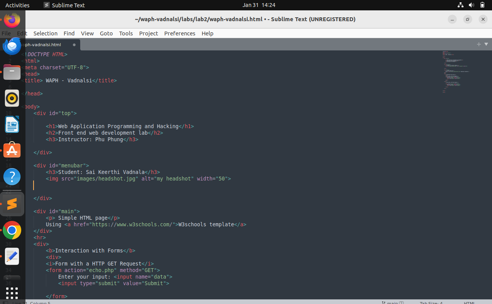 

- The output of this task is (fig 3):
 

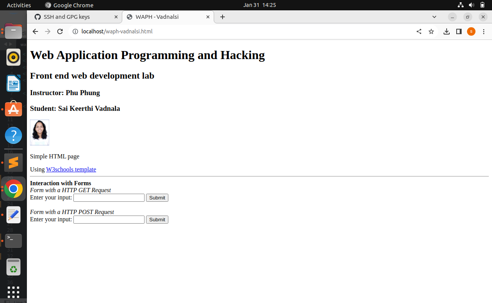 

## B.Simple Javascript

- After creating the forms, I have created an inline javascript code.
- This code upon clicking on "click to show date()" displays the current date.
- Inside a div tag onclick="document.getElementById('date').innerHTML=Date() includes a functionality to display the date. (fig )
 
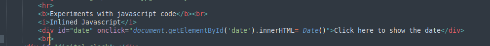 

- Now the task is to develop a JavaScript code in a <script> tag to display a digital clock 
- I developed a function to display clock and I have set the interval to change the time for every 500 ms (fig )
 

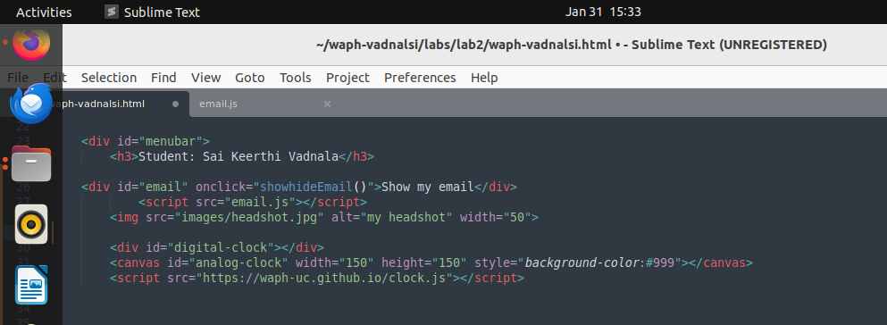 

- Next I have written a code to show my email id when I clicked on 'show my email'.
- For this, I have included javascript code inside a new file named "email.js" (fig )
 

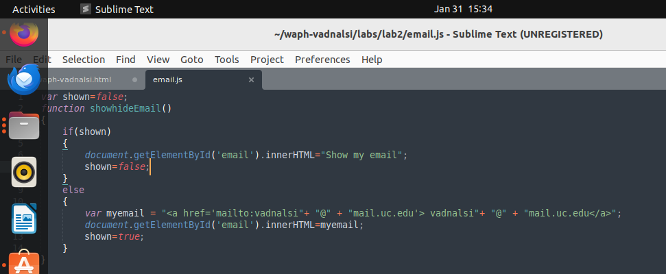 

- Also, I have included an external javascript file "clock.js" 
- I used canvas to draw the clock image and a functions to draw the clock (fig ) 
 

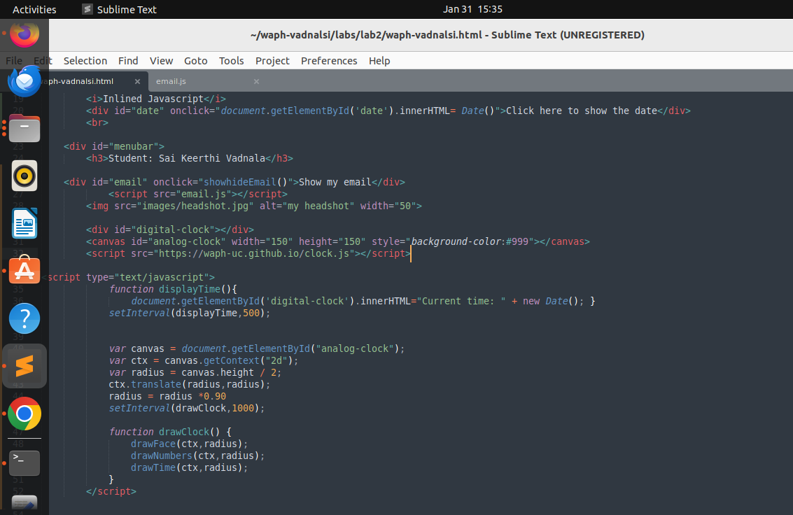 

- The following screenshots are the total code for Task 1 : (fig  , )

 

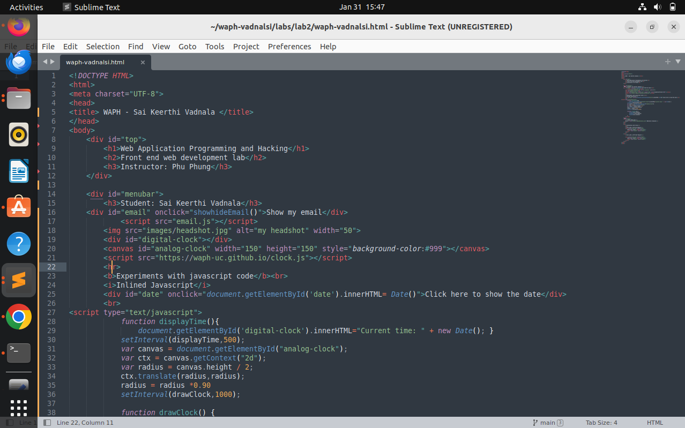 

 

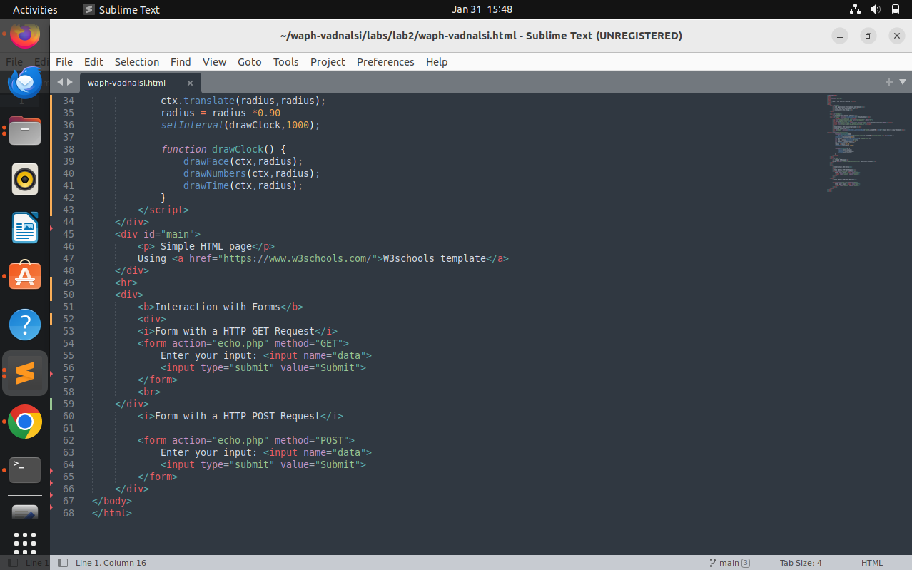 

- Output screenshots for Task1 (fig ): 

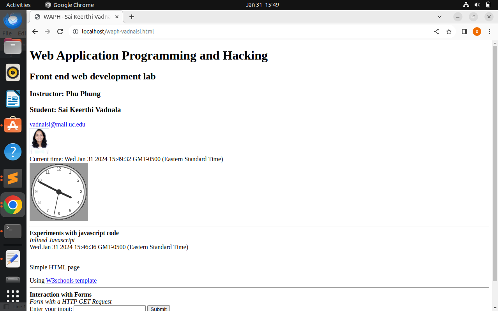 

 

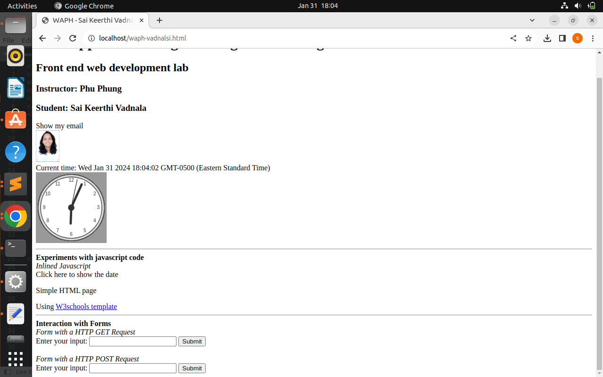 

## Task 2 - Ajax, CSS, jQuery and web API integration

- **A.Ajax**   

- Ajax stands for Asynchronous JavaScript and XML, it enables web browsers to collect and exchange data with the web without reloading the page.
- I have integrated an input tag for user input, a button for submission, and a div element for JavaScript code, all placed after the form.
- And for request Handling Function, I have implemented a function, getEcho(), to process requests by checking the input length before initiating the request.
- I have created an Ajax object and set up an onreadystatechange function to handle the asynchronous request.
- It prints the response text if the ready state is 4 and the status is 200, indicating a successful request.
- I have written a code to create an Ajax request and send it to the server, utilizing the echo.php file to handle the initialized GET request.
- The xhttp.open function initiates communication with the server, facilitating the exchange of data without reloading the entire webpage.
- Echo.php effectively manages the GET request, ensuring proper handling and processing of data from the client-side request.

- Code for the getecho function (fig )

 

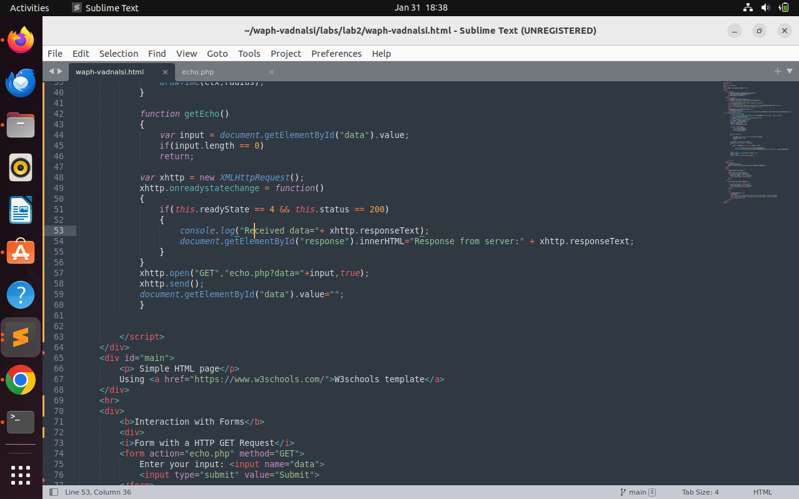 

- Output of the ajax response is(fig )

 

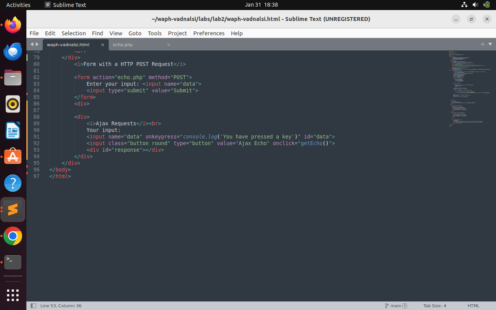 

- I understood the Ajax request/response dynamics in the network window 
- I have initiated a new capture and observed the console window displaying the response, upon submitting a request.
- Also, inspected the echo.php response, and found thestatus code of 200, indicating successful handling of the request.
- Later I observed dynamic changes in the console reponse messages and the execution count, which altered each time the request was run.
- Below are the outputs of this task (fig  , )
 

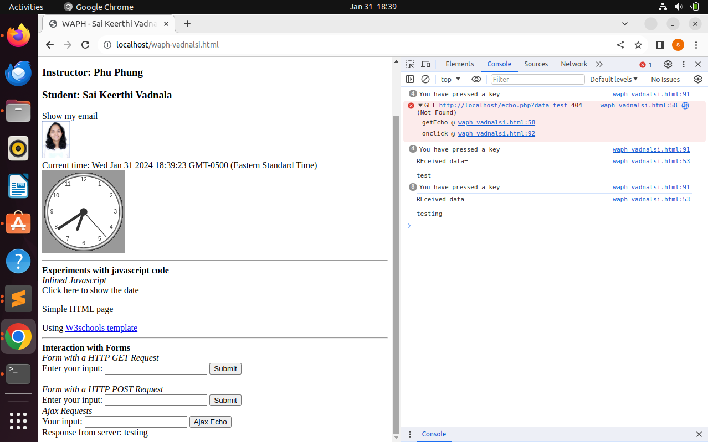 

 

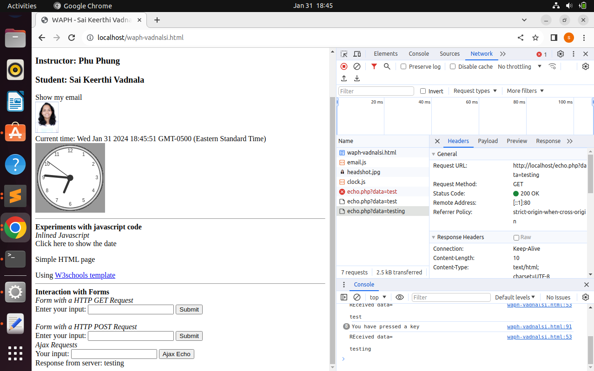 

- **B.CSS**

- External CSS is applied through a separate file linked to the HTML, internal CSS is embedded within the HTML document, and inline CSS is directly applied to specific HTML elements.
- I have used a external CSS to apply a separate style sheet to the HTML page for improved styling.
- I have also  Incorporated a remote CSS file, provided in class, into the HTML page's head tag.
- Modified the HTML code to align with the external CSS and arranged different div tags within the main div container, following the structure defined by the external CSS.
- Next, I added a style for ajax request button in the head tag as an internal css.
- Added the class name to the ajax input button and changed the value from submit to Ajax Echo. 
- Below screenshot is the output of all types of CSS (fig )

 

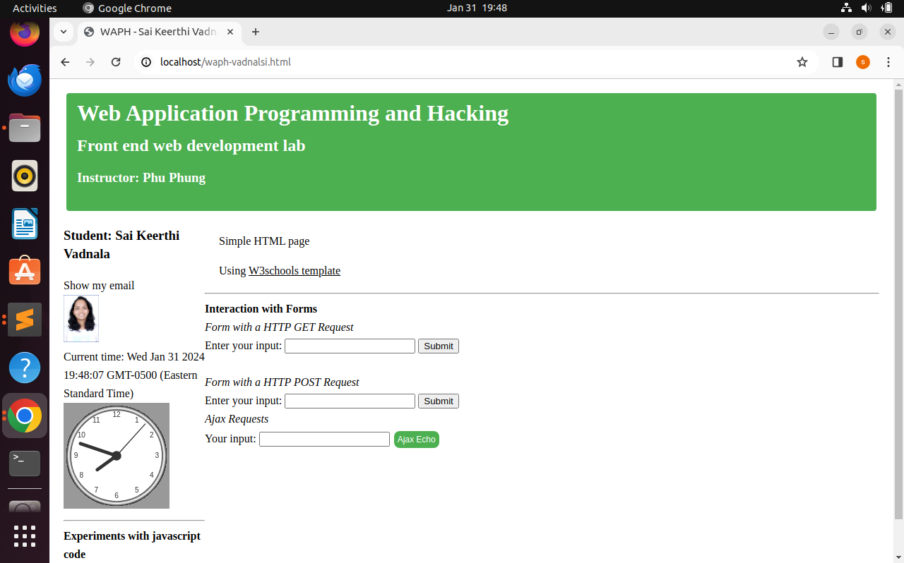

- I have added a style tag in the head tag as an internal css
- And also applied background color to the body as powder blue and h1 tag to color: blue (fig )
 

 **C.jQuery**

- jQuery is a popular javascript library that provides easy way to access APIs and working on it. Particularly it can simplify the complex tasks.
- I copied the jquery script code into the head section. It is required for the jquery to run
- **i.jQuery $.get():** 
- First a new button is added at the bottom to call the function jQueryAjax() when it is clicked
- A new function jQueryAjax() is created for an ajax get request and it will prints the response back
- Data which we entered is fetched in a variable. A general test is performed whether the data is empty or not by length function
- Next, jQuery selector gets the echo.php file and it reads the input from the container and print back the response by selecting #response id

- jQuery is a popular JavaScript library, which streamlines API interactions and simplifies tasks efficiently.
- I have copied the jQuery script into the head section, essential for enabling jQuery functionality.
- I have also introduced a new button which triggers the jQueryAjax() function upon clicking for a Ajax GET request.
- The jQueryAjax() function fetches entered data, and ensures that it is not empty using the length function.
- It utilizes a jQuery selector to access echo.php, reads input from the container, and prints back the response on the page using the #response id.

 
- **ii.jQuery $.post():** 

- I have created a new button, which similar to the previous one, to trigger the jQueryAjaxPost() function upon clicking.
- I have created the jQueryAjaxPost() function to handle an Ajax POST request and print the response.
- To validate the data I have fetched the entered data into a variable,
- I have used a jQuery selector to access echo.php, read the input from the container, and printed back the response using the #response id.

- Code for both Ajax GET and POSt is shown below (fig  , )

 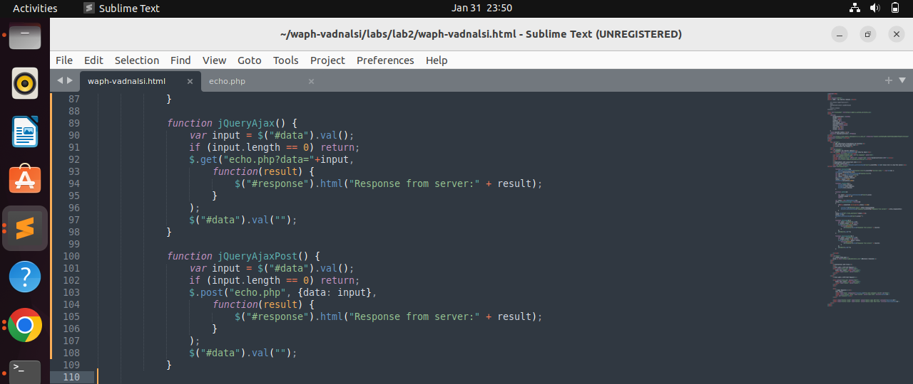

 -Output for this task is : (fig )

  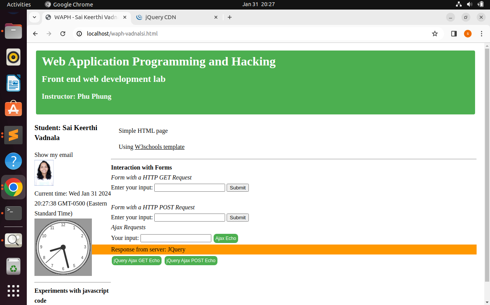

=---------------------------------------------------

 - **D. Web API integration**
 
 - We can integrate any free APIs inside our html page using jQuery.
 - **i.Ajax on API:** The idea of this is to integrate a joke api by sending a request and to display the response of a random joke
 - A ajax request code is written in an old script tag
 - $.get()fetches the api for the response and JSON is used for formatting the response data
 - There is no button created for handling the joke. Therefore this request will execute everytime when the page is reloaded. 
 - code and output (fig 18): 
 
 
 
 - After refreshing a browser, I have inspected the network window
 - Everytime, when a browser is reloaded a random joke is fetched and printed in the console window as API code
 - In request windows, status is showing as 200 ok and in the response tab, it is displaying the api code which is fetched (fig 19) 
 
 
 
 -**ii.Using fetch api:** 
 
 - Guessing the age based on name is an another api I have fetched in this sub task
 - I have created a input button guess age to execute an api when the button is clicked
 - Next I have created a async function guessAge
 - I used fetch() which is a javascript method for fetching results across the network
 - It will return a promise
 - Now the api will respond and code will handle the response 
 - Code and output: (fig 20) 
 
 
 
 - Next, I have inspected the network windows for the response 
 - It shows 200 ok and in response window it fetches the output in an api code (fig 21)  
 
 
 
 

